```mermaid
%%{init: {'theme':'dark', 'themeVariables': { 'primaryColor':'#10B981','primaryTextColor':'#000','primaryBorderColor':'#8B5CF6','lineColor':'#06B6D4','secondaryColor':'#1a1b27','tertiaryColor':'#0D1117','edgeLabelBackground':'#0D1117','nodeTextColor':'#fff'}}}%%
graph LR
    A[💻 Full Stack Dev] -->|Integrate| B[🤖 AI Solutions]
    B -->|Build| C[🚀 AI SaaS Products]
    C -->|Automate| D[⚡ Task Automation]
    D -->|Optimize| E[📊 Workflow Efficiency]
    E -->|Scale| F[☁️ Production Ready]
    F -->|Impact| G[🌟 Real-World Solutions]
    
    style A fill:#10B981,stroke:#8B5CF6,stroke-width:3px,color:#000
    style B fill:#1a1b27,stroke:#10B981,stroke-width:2px
    style C fill:#1a1b27,stroke:#8B5CF6,stroke-width:2px
    style D fill:#1a1b27,stroke:#06B6D4,stroke-width:2px
    style E fill:#1a1b27,stroke:#10B981,stroke-width:2px
    style F fill:#1a1b27,stroke:#8B5CF6,stroke-width:2px
    style G fill:#8B5CF6,stroke:#10B981,stroke-width:3px,color:#fff
```

<div align="center">


<h3>
  
</h3>

</div>

---

###  About Me


```typescript
interface Developer {
  name: string;
  location: string;
  role: string[];
  currentlyLearning: string[];
  techStack: {
    ai: string[];
    backend: string[];
    frontend: string[];
    cloud: string[];
  };
}

const nitish: Developer = {
  name: "Nitish Goswami",
  location: "Guwahati, India 🇮🇳",
  role: ["Full Stack Developer", "AI Integration Specialist", "Automation Enthusiast"],
  currentlyLearning: [
    "Integrating AI into Full Stack Applications",
    "Building AI-Powered SaaS Solutions",
    "Automating Complex Workflows with AI Agents"
  ],
  techStack: {
    ai: ["LangChain", "LangGraph", "LangSmith", "Python"],
    backend: ["Node.js", "Express", "Flask", "MongoDB"],
    frontend: ["React", "JavaScript", "GSAP", "HTML5"],
    cloud: ["AWS", "Docker", "Appwrite"]
  }
};
```

<br clear="right"/>

---

<div align="center">

###  Let's Connect

<a href="https://linkedin.com/in/nitishgoswami/">
  
</a>
&nbsp;&nbsp;
<a href="mailto:itsgoswaminitish@gmail.com">
  
</a>
&nbsp;&nbsp;
<a href="https://github.com/nitishgoswami-git">
  
</a>

</div>

---

###  Tech Stack

<div align="center">

<table>
<tr>
<td align="center" width="25%">
<h4> AI & ML</h4>

<br>


</td>

<td align="center" width="25%">
<h4> Backend</h4>

<br>


</td>

<td align="center" width="25%">
<h4> Frontend</h4>

<br>

</td>

<td align="center" width="25%">
<h4> DevOps</h4>

<br>

</td>
</tr>
</table>

</div>

---

###  GitHub Stats

<div align="center">
  
  
</div>

<div align="center">
  
  
</div>

---

###  Current Mission

<div align="center">



</div>

---

<div align="center">

###  ***"Transforming full stack development with AI—automating workflows, simplifying complexity, and building smarter solutions"***


###  ***If you like what you see, drop a star on my repositories!***

</div>
